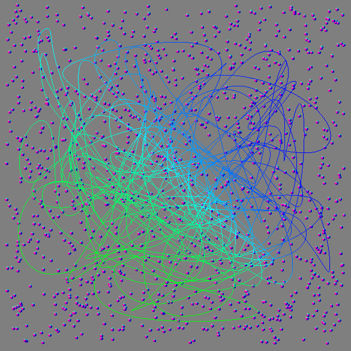
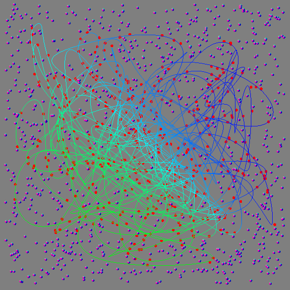
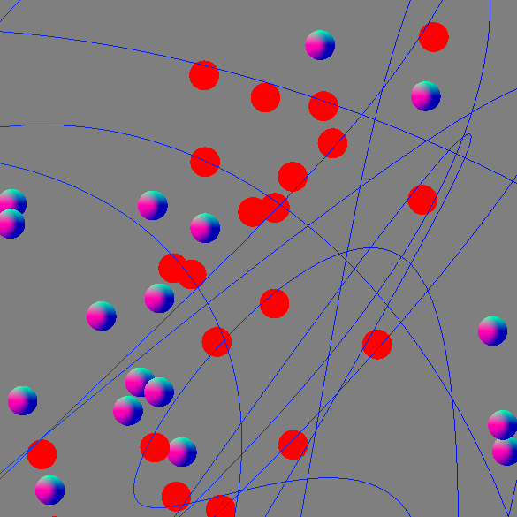

# Spatial Hashing



This project was based on the paper [A Hash Table Construction Algorithm for Spatial Hashing Based on Linear Memory](https://www.researchgate.net/profile/Per-Gustavsson-2/publication/277870601_A_Hash_Table_Construction_Algorithm_for_Spatial_Hashing_Based_on_Linear_Memory/links/5575840a08ae7521586abaab/A-Hash-Table-Construction-Algorithm-for-Spatial-Hashing-Based-on-Linear-Memory.pdf). It was part of an assignment to implement this algorithm together with other computer graphics techniques.

The program generates a random Bezier curve and random points scattered across a plane. Everytime any point is modified, the hash table has to be regenerated. When using the hash table to check collisions, each segment of the curve access a cell of the hash table and checks collisions only with circles inside this cell. This turns out to be orders of magnitude faster than comparing with all circles, specially if circles are sparsely distributed.

After checking the collisions, the program outputs how much time it took to do it and colors in red all circles that were intercepted by the curve. Increasing curve dimension can mitigate float precision problems when checking collisions.




## Running the project

#### First, make sure you have `GLFW` in your system includes.

```cmd
sudo apt-get install libglfw3-dev
```

#### The project is built with CMake. In the main directory, run:

```cmd
mkdir build
cd build
```

#### Inside the build directory, run:

```cmd
cmake ../
cmake --build .
```

#### And finally, run this to execute:

```cmd
./SpatialHashing
```

## Keybindings

#### Testing
- 1 --- Toggle wireframe
- 2 --- Check collisions through bruteforce
- 3 --- Check collisions through hash table
- 4 --- Restart circles

#### Parameters tuning
- T --- Add 50 circles
- G --- Remove 50 circles
- Y --- Add 50 curve segments
- H --- Remove 50 curve segments
- R --- Increase circle radius
- F --- Decrease circle radius

#### Camera movement
- Q --- Move up
- E --- Move down
- W --- Move forwards
- S --- Move backwards
- D --- Move to the right
- A --- Move to the left